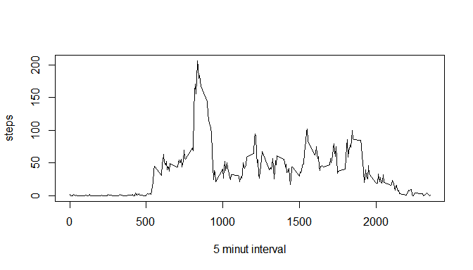
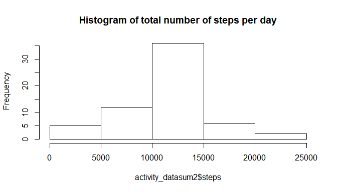
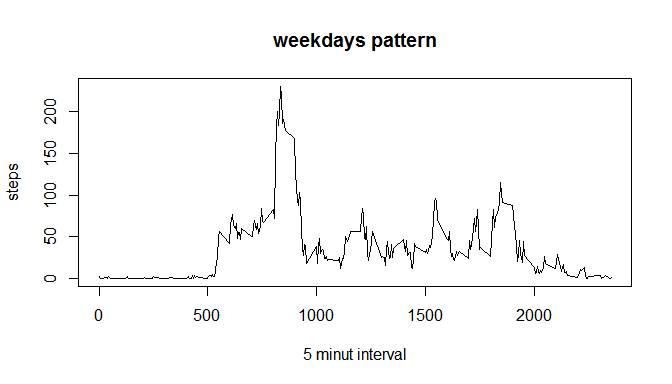
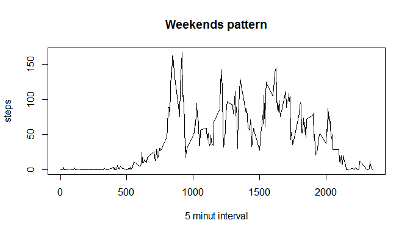

# Reproducible Research: Peer Assessment 1


## Loading and processing data 
Read csv file from your working directory, and store the csv file in variable and eliminate all missing values


```r
activity_raw <- read.csv("activity.csv", header = TRUE, sep = ",")
activity_data <- complete.cases(activity_raw)
IDna <- !is.na(activity_raw$steps)
activity_data <- activity_raw[IDna,]
```


## What is mean total number of steps taken per day?
For getting this parameter is needed to get the total steps per day, this is achieved using the aggregate function  and then the mean.
### Answer

```r
activity_datasum <- aggregate(steps ~ date, activity_data, sum)
mean(activity_datasum$steps)
```

```
## [1] 10766.19
```

```r
median(activity_datasum$steps)
```

```
## [1] 10765
```


## What is the average daily activity pattern?
For getting this parameter is need to get the average per five minute interval then plotting these averages on a linear plot.

```r
activity_datainterval <- aggregate(steps ~ interval, activity_data, mean)
plot(activity_datainterval$interval, activity_datainterval$steps, type ="l", xlab = "5 minut interval", ylab = "steps")
```

 
### Answer
The pattern shows an intense activity at morning and middle activity through the day


##Imputing missing values
1 Calculate and report the total number of missing values in the dataset.

```r
sum(is.na(activity_raw))
```

```
## [1] 2304
```
2 and 3 Devise a strategy for filling in all of the missing values in the dataset.
and Create a new dataset that is equal to the original dataset but with the missing data filled in

```r
for (i in 1:17568) {
   if (is.na(activity_raw$steps[i])) {
       for (j in 1:288){
           if (activity_raw$interval[i]==activity_datainterval$interval[j]) {
               activity_raw$steps[i] <- activity_datainterval$steps[j]
           }
       }
   }
}
head(activity_raw)
```

```
##       steps       date interval
## 1 1.7169811 2012-10-01        0
## 2 0.3396226 2012-10-01        5
## 3 0.1320755 2012-10-01       10
## 4 0.1509434 2012-10-01       15
## 5 0.0754717 2012-10-01       20
## 6 2.0943396 2012-10-01       25
```
4 Make a histogram of the total number of steps taken each day and Calculate and report the mean and median total number of steps taken per day

```r
activity_datasum2 <- aggregate(steps ~ date, activity_raw, sum)
hist(activity_datasum2$steps, main = paste("Histogram of total number of steps per day"))
```

 

```r
mean(activity_datasum2$steps)
```

```
## [1] 10766.19
```

```r
median(activity_datasum2$steps)
```

```
## [1] 10766.19
```
### Answer
There is not any difference when imputing missing values for the means of the intervals, for the number of data this was expected.


## Are there differences in activity patterns between weekdays and weekends?
Add a column for the the day of the week, add another column for identify de weekends.
Then subset the data by weekdays and by weekends.
With the aggregate function get the mean by interval for each subset and plot it.

Code for identify day of the week

```r
for (i in 1:17568) {
  activity_raw$day[i] <- weekdays(strptime(activity_raw$date[i], "%Y-%m-%d"))
  if (activity_raw$day[i] == "sábado" | activity_raw$day[i] == "domingo"){
  activity_raw$weekend[i] <- 1
  }
  else {activity_raw$weekend[i] <- 0}
}
```

Code for plot weekdays

```r
activity_raw1 <- subset(activity_raw, activity_raw$weekend == 0)
activity_dataintervalweekdays <- aggregate(steps ~ interval, activity_raw1, mean)
plot(activity_dataintervalweekdays$interval, activity_dataintervalweekdays$steps, type ="l", xlab = "5 minut interval", ylab = "steps", main = "weekdays pattern")
```

 

Code for plot weekends

```r
activity_raw2 <- subset(activity_raw, activity_raw$weekend == 1)
activity_dataintervalweekends <- aggregate(steps ~ interval, activity_raw2, mean)
plot(activity_dataintervalweekends$interval, activity_dataintervalweekends$steps, type ="l", xlab = "5 minut interval", ylab = "steps", main = "Weekends pattern")
```

 

### Answer
There is a higher activity on the weekends through the day, although the activity starts later on the morning.
